# Home Assistant Automations

> Auto-generated documentation. Do not edit manually — regenerate via Claude when automations change.
>
> **Order:** Sorted by internal automation ID (creation order).

---

## 1. System: Home Assistant Update
**Entity:** `automation.update_system`

Runs at 3 AM daily, installs HA core/OS/supervisor updates with backup, then reboots.

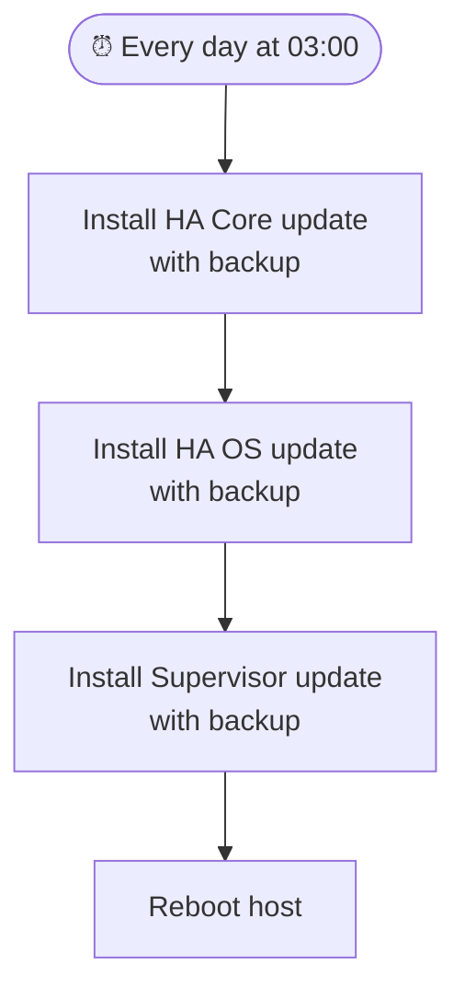
```mermaid
flowchart TD
    T([⏰ Every day at 03:00]) --> A[Install HA Core update\nwith backup]
    A --> B[Install HA OS update\nwith backup]
    B --> C[Install Supervisor update\nwith backup]
    C --> D[Reboot host]
```

---

## 2. System: Server Fan Toggle
**Entity:** `automation.toggle_fan_status`

Toggles server fan power whenever the `fan_on_or_off` boolean changes state.

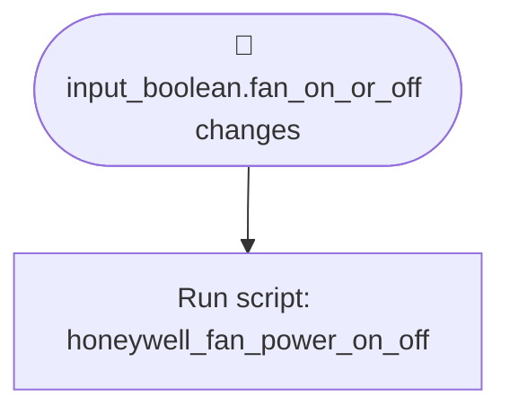
```mermaid
flowchart TD
    T([🔁 input_boolean.fan_on_or_off changes]) --> A[Run script: honeywell_fan_power_on_off]
```

---

## 3. Media: Jumbotron Off
**Entity:** `automation.turn_off_jumbotron`

Turns off the Jumbotron switch at midnight.

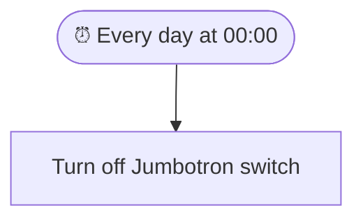
```mermaid
flowchart TD
    T([⏰ Every day at 00:00]) --> A[Turn off Jumbotron switch]
```

---

## 4. Media: Jumbotron On
**Entity:** `automation.turn_on_jumbotron`

Turns on the Jumbotron switch 30 minutes after sunset.

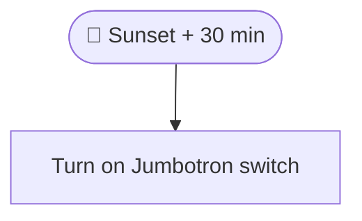
```mermaid
flowchart TD
    T([🌇 Sunset + 30 min]) --> A[Turn on Jumbotron switch]
```

---

## 5. Notification: Jellyseerr
**Entity:** `automation.jellyseerr_notifications`

Receives Jellyseerr webhook events and sends formatted iPhone notifications for media requests, approvals, availability, and issues.

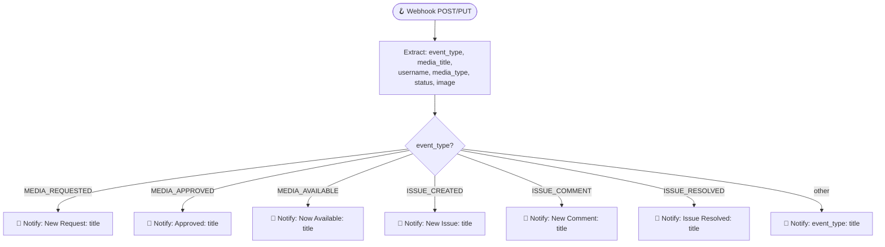
```mermaid
flowchart TD
    T([🪝 Webhook POST/PUT]) --> V[Extract: event_type, media_title,\nusername, media_type, status, image]
    V --> C{event_type?}
    C -->|MEDIA_REQUESTED| N1[📱 Notify: New Request: title]
    C -->|MEDIA_APPROVED| N2[📱 Notify: Approved: title]
    C -->|MEDIA_AVAILABLE| N3[📱 Notify: Now Available: title]
    C -->|ISSUE_CREATED| N4[📱 Notify: New Issue: title]
    C -->|ISSUE_COMMENT| N5[📱 Notify: New Comment: title]
    C -->|ISSUE_RESOLVED| N6[📱 Notify: Issue Resolved: title]
    C -->|other| N7[📱 Notify: event_type: title]
```

---

## 6. Lighting: Sleep Mode
**Entity:** `automation.lights_sleep_mode_all_red`

When iPhone Sleep Focus turns on: turns off Apple TV remote & two Tapo plugs, applies bedtime red lighting everywhere, turns off Nintendo toy.

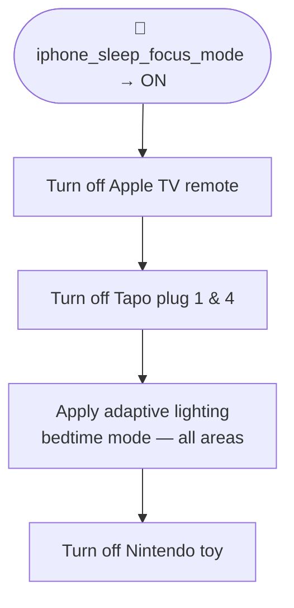
```mermaid
flowchart TD
    T([📱 iphone_sleep_focus_mode → ON]) --> A[Turn off Apple TV remote]
    A --> B[Turn off Tapo plug 1 & 4]
    B --> C[Apply adaptive lighting\nbedtime mode — all areas]
    C --> D[Turn off Nintendo toy]
```

---

## 7. Lighting: Wake Up Mode
**Entity:** `automation.lights_morning_on_focus_off_all_white`

When Sleep Focus turns off or All Lights White is pressed: clears the adaptive lighting pause flag, restores adaptive lighting to all areas, starts Nintendo toy alternating animation.

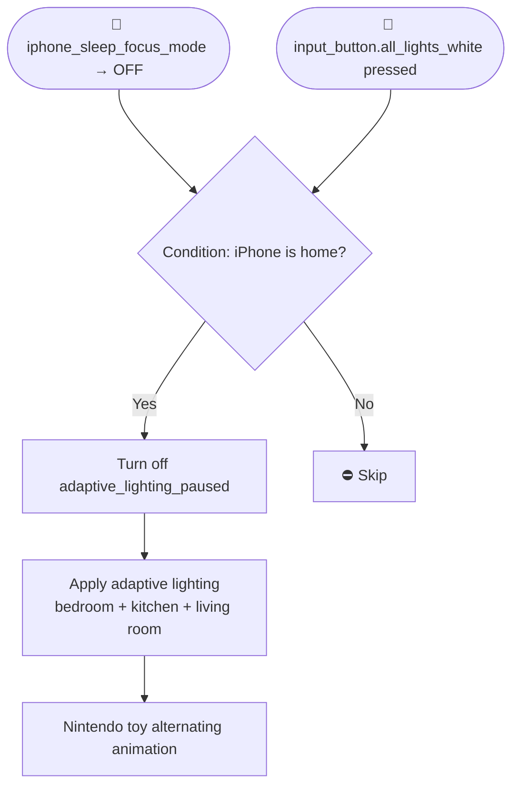
```mermaid
flowchart TD
    T1([📱 iphone_sleep_focus_mode → OFF]) --> C
    T2([🔘 input_button.all_lights_white pressed]) --> C
    C{Condition: iPhone is home?}
    C -->|Yes| A[Turn off adaptive_lighting_paused]
    A --> B[Apply adaptive lighting\nbedroom + kitchen + living room]
    B --> D[Nintendo toy alternating animation]
    C -->|No| SKIP[⛔ Skip]
```

---

## 8. Climate: Pre-arrival Conditioning
**Entity:** `automation.set_climate_on_the_way_home`

When arriving home: fetches Apple Weather forecast. If high ≥ 65°F forces cool mode. Otherwise restores previous AC state if it was on.

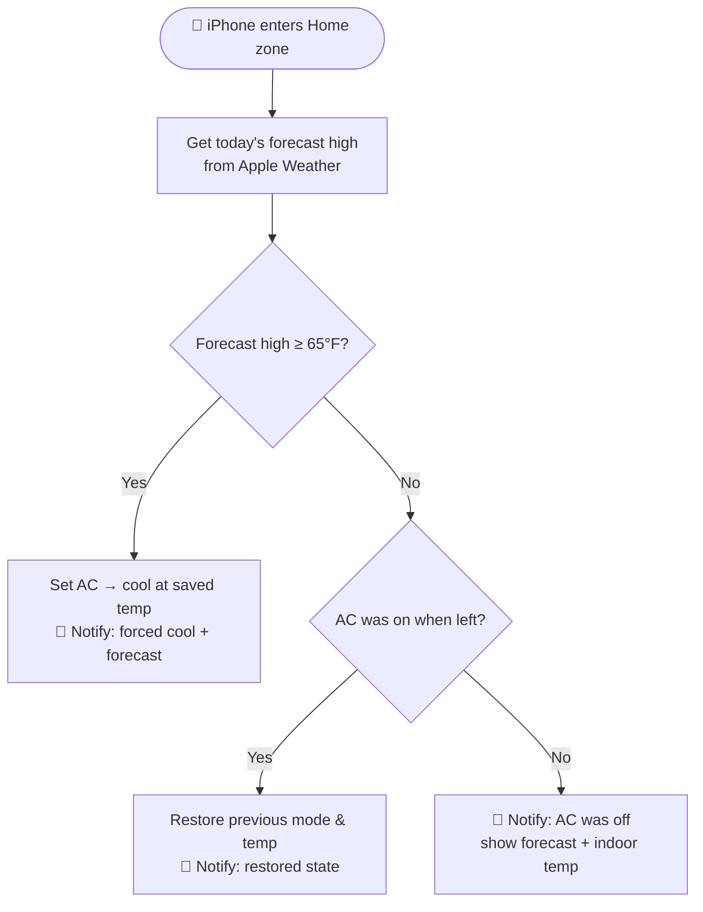
```mermaid
flowchart TD
    T([📍 iPhone enters Home zone]) --> W[Get today's forecast high\nfrom Apple Weather]
    W --> C1{Forecast high ≥ 65°F?}
    C1 -->|Yes| COOL[Set AC → cool at saved temp\n📱 Notify: forced cool + forecast]
    C1 -->|No| C2{AC was on when left?}
    C2 -->|Yes| RESTORE[Restore previous mode & temp\n📱 Notify: restored state]
    C2 -->|No| OFF[📱 Notify: AC was off\nshow forecast + indoor temp]
```

---

## 9. Lighting: Kitchen Sink Night
**Entity:** `automation.make_sink_brighter_at_night`

During sleep mode, briefly brightens kitchen sink light to full red when motion is detected, then dims back after 30 seconds.

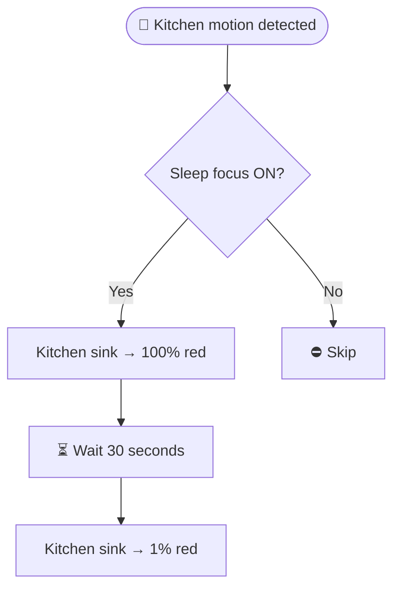
```mermaid
flowchart TD
    T([🚶 Kitchen motion detected]) --> C{Sleep focus ON?}
    C -->|Yes| A[Kitchen sink → 100% red]
    A --> D[⏳ Wait 30 seconds]
    D --> E[Kitchen sink → 1% red]
    C -->|No| SKIP[⛔ Skip]
```

---

## 10. Media: Theater Mode On
**Entity:** `automation.theater_lights_on`

When Apple TV starts playing video: dims/adjusts living room lights based on time of day, respects eating mode for back lights, turns off cubby.

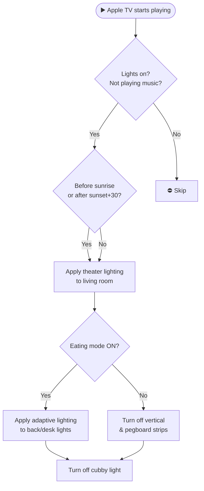
```mermaid
flowchart TD
    T([▶️ Apple TV starts playing]) --> C1{Lights on?\nNot playing music?}
    C1 -->|Yes| C2{Before sunrise\nor after sunset+30?}
    C2 -->|Yes| DIM[Apply theater lighting\nto living room]
    C2 -->|No| DIM
    DIM --> C3{Eating mode ON?}
    C3 -->|Yes| BACK[Apply adaptive lighting\nto back/desk lights]
    C3 -->|No| BACKOFF[Turn off vertical\n& pegboard strips]
    BACK --> CUBBY[Turn off cubby light]
    BACKOFF --> CUBBY
    C1 -->|No| SKIP[⛔ Skip]
```

---

## 11. Presence: Sunset Triggers
**Entity:** `automation.sunset_switches`

Turns on Tapo power strip plugs 1 & 4 at 15 minutes past sunset, only if home.

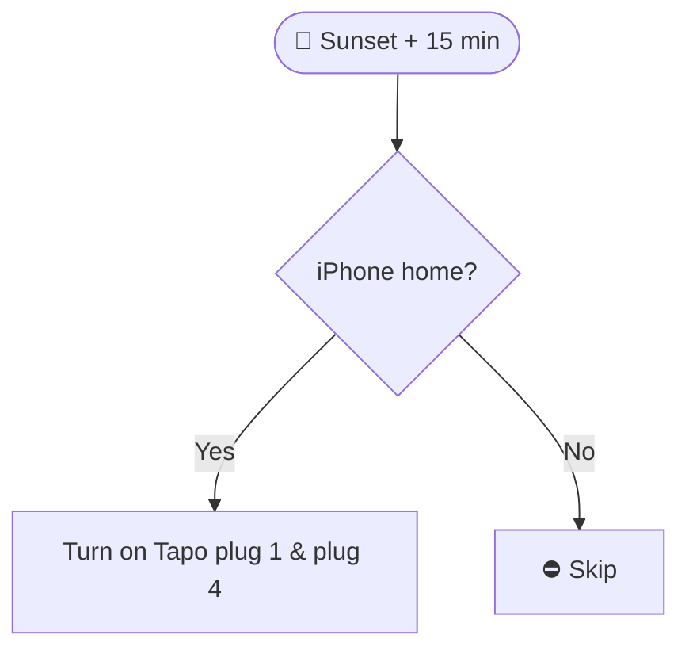
```mermaid
flowchart TD
    T([🌇 Sunset + 15 min]) --> C{iPhone home?}
    C -->|Yes| A[Turn on Tapo plug 1 & plug 4]
    C -->|No| SKIP[⛔ Skip]
```

---

## 12. Notification: Kitchen Cleanup Cancel
**Entity:** `automation.handle_cancel_kitchen_cleanup_notification`

Handles the CANCEL_VACUUM notification action — turns off the vacuum flag and sends confirmation.

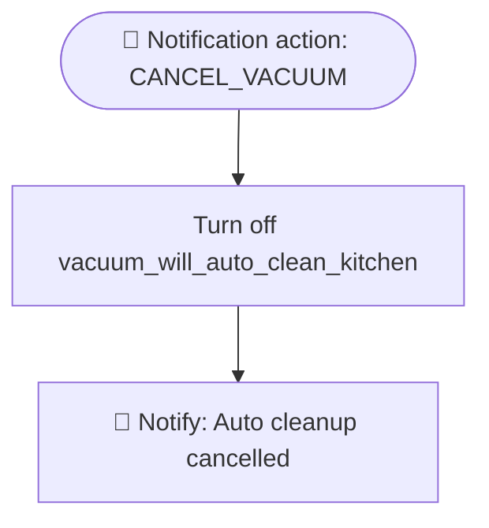
```mermaid
flowchart TD
    T([📱 Notification action: CANCEL_VACUUM]) --> A[Turn off vacuum_will_auto_clean_kitchen]
    A --> N[📱 Notify: Auto cleanup cancelled]
```

---

## 13. Lighting: Bathroom Presence
**Entity:** `automation.bathroom_presence_lighting`

Presence-based bathroom lighting. Turns on with adaptive or bedtime lighting when presence detected, turns off when clear.

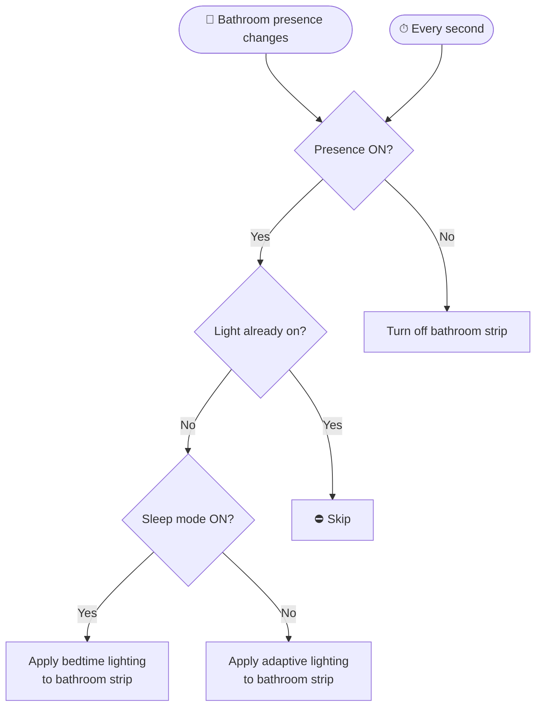
```mermaid
flowchart TD
    T1([👤 Bathroom presence changes]) --> CHECK
    T2([⏱ Every second]) --> CHECK
    CHECK{Presence ON?}
    CHECK -->|Yes| C2{Light already on?}
    C2 -->|No| C3{Sleep mode ON?}
    C3 -->|Yes| BED[Apply bedtime lighting\nto bathroom strip]
    C3 -->|No| ADAPT[Apply adaptive lighting\nto bathroom strip]
    C2 -->|Yes| SKIP[⛔ Skip]
    CHECK -->|No| OFF[Turn off bathroom strip]
```

---

## 14. Lighting: Bedtime Transition
**Entity:** `automation.lighting_going_to_sleep`

When iPhone starts charging during sleep focus mode, dims all lights to 1% red and turns off Nintendo toy.

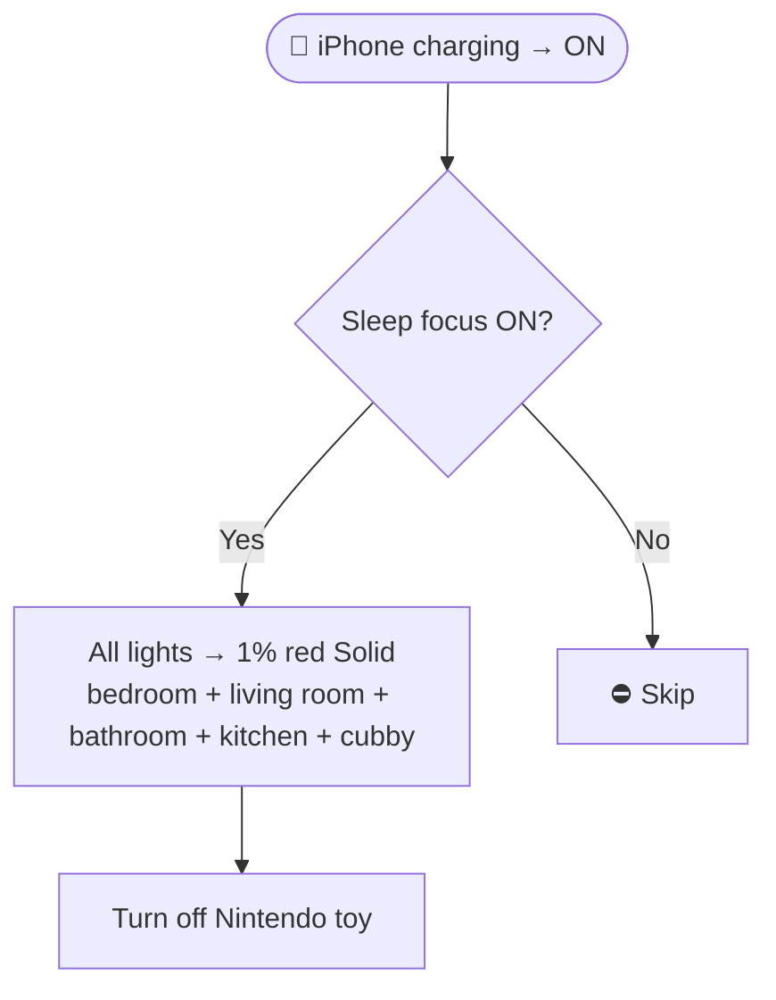
```mermaid
flowchart TD
    T([🔌 iPhone charging → ON]) --> C{Sleep focus ON?}
    C -->|Yes| A[All lights → 1% red Solid\nbedroom + living room + bathroom + kitchen + cubby]
    A --> B[Turn off Nintendo toy]
    C -->|No| SKIP[⛔ Skip]
```

---

## 15. Media: Apple TV Auto Reload
**Entity:** `automation.auto_reload_apple_tv_integration`

Every minute, if Apple TV is unavailable/unknown/off/paused/standby, reloads the Apple TV integration config entry.

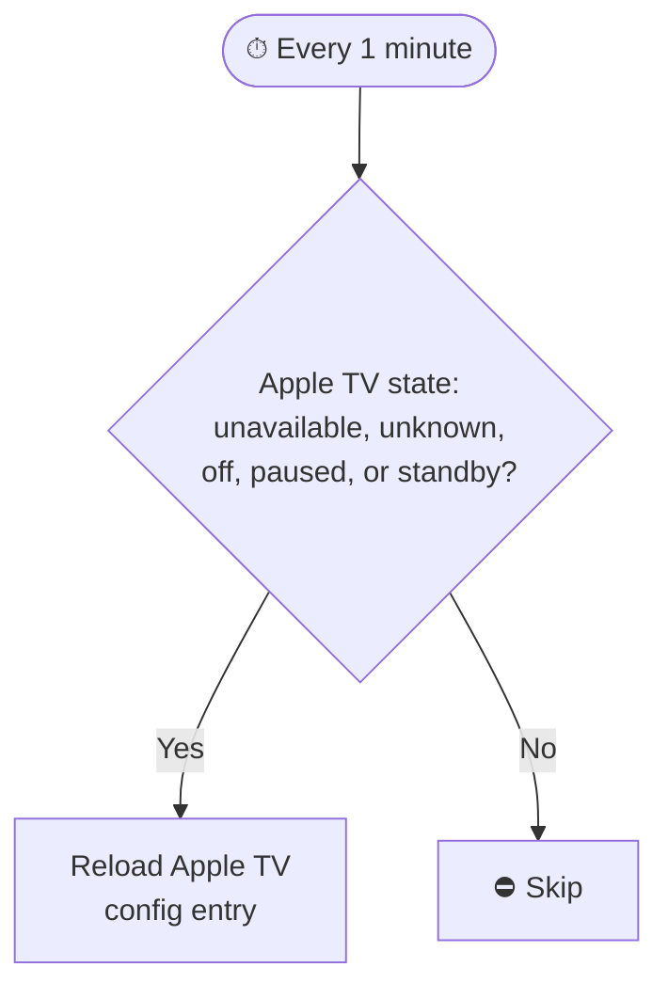
```mermaid
flowchart TD
    T([⏱ Every 1 minute]) --> C{Apple TV state:\nunavailable, unknown,\noff, paused, or standby?}
    C -->|Yes| A[Reload Apple TV\nconfig entry]
    C -->|No| SKIP[⛔ Skip]
```

---

## 16. Lighting: Bedroom Presence
**Entity:** `automation.bedroom_scene_presence`

Presence-based bedroom lighting using mmWave sensor. Turns off lights when presence gone + moving distance > 100. Turns on adaptive lighting on motion or time-check.

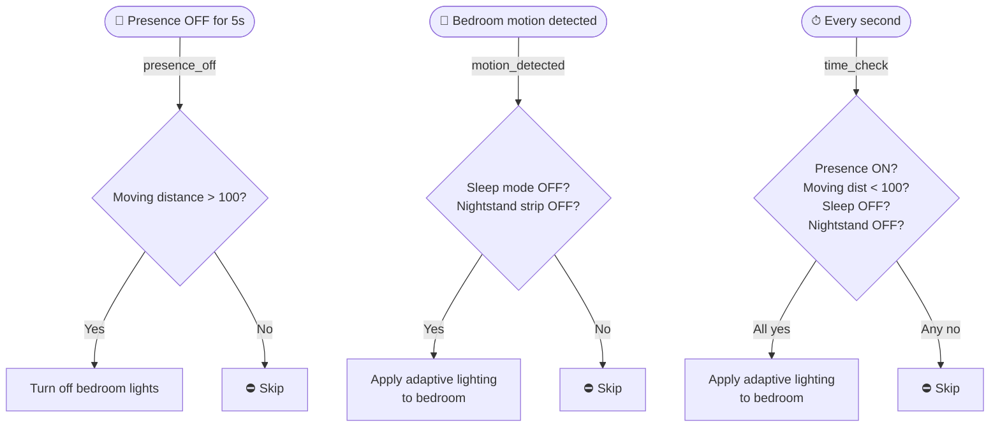
```mermaid
flowchart TD
    T1([👤 Presence OFF for 5s]) -->|presence_off| C1{Moving distance > 100?}
    C1 -->|Yes| OFF[Turn off bedroom lights]
    C1 -->|No| SKIP1[⛔ Skip]

    T2([🚶 Bedroom motion detected]) -->|motion_detected| C2{Sleep mode OFF?\nNightstand strip OFF?}
    C2 -->|Yes| ON[Apply adaptive lighting\nto bedroom]
    C2 -->|No| SKIP2[⛔ Skip]

    T3([⏱ Every second]) -->|time_check| C3{Presence ON?\nMoving dist < 100?\nSleep OFF?\nNightstand OFF?}
    C3 -->|All yes| ON2[Apply adaptive lighting\nto bedroom]
    C3 -->|Any no| SKIP3[⛔ Skip]
```

---

## 17. Lighting: Effect Handler
**Entity:** `automation.light_effect_handler`

Every 30s or on Apple TV state change: applies music effects to WLED strips when music is playing, reverts to Solid when not.

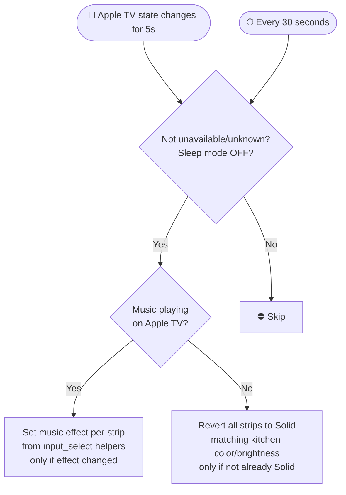
```mermaid
flowchart TD
    T1([🎵 Apple TV state changes for 5s]) --> C0
    T2([⏱ Every 30 seconds]) --> C0
    C0{Not unavailable/unknown?\nSleep mode OFF?}
    C0 -->|Yes| C1{Music playing\non Apple TV?}
    C1 -->|Yes| MUSIC[Set music effect per-strip\nfrom input_select helpers\nonly if effect changed]
    C1 -->|No| SOLID[Revert all strips to Solid\nmatching kitchen color/brightness\nonly if not already Solid]
    C0 -->|No| SKIP[⛔ Skip]
```

---

## 18. Presence: Kitchen Motion Tracker
**Entity:** `automation.set_last_kitchen_motion_sensor`

Records the current timestamp to `input_datetime.last_kitchen_motion_sensor_trigger` whenever kitchen motion fires.

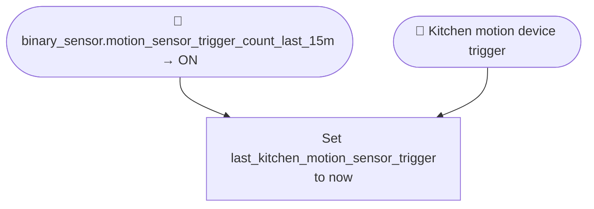
```mermaid
flowchart TD
    T1([🚶 binary_sensor.motion_sensor_trigger_count_last_15m → ON]) --> A
    T2([🚶 Kitchen motion device trigger]) --> A
    A[Set last_kitchen_motion_sensor_trigger\nto now]
```

---

## 19. Presence: Guest Mode
**Entity:** `automation.guest_mode_toggle`

Disables automations labelled `guest_mode_disabled` when guest mode is on, re-enables when off.

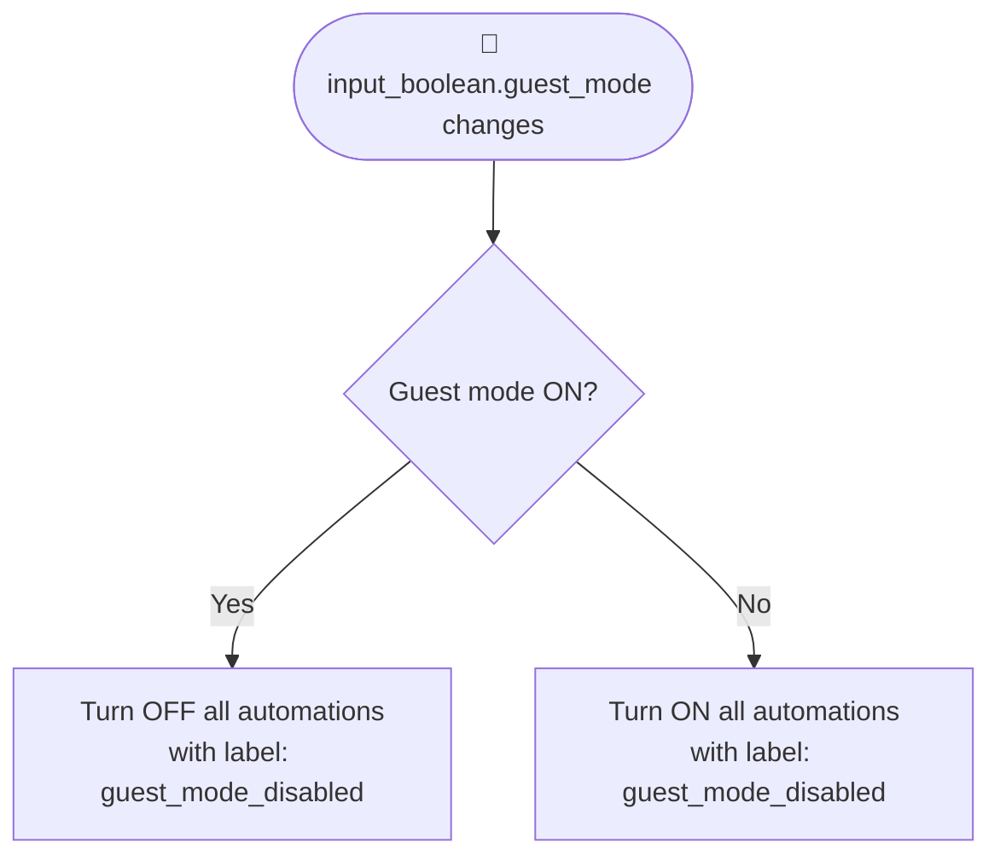
```mermaid
flowchart TD
    T([🔁 input_boolean.guest_mode changes]) --> C{Guest mode ON?}
    C -->|Yes| A[Turn OFF all automations\nwith label: guest_mode_disabled]
    C -->|No| B[Turn ON all automations\nwith label: guest_mode_disabled]
```

---

## 20. Media: Fix Google TV Apple TV
**Entity:** `automation.fix_google_tv_not_launching_apple_tv`

When Apple TV goes idle, checks for 60 seconds if Google TV is stuck on Settings/Launcher screen, and if so fires the input select script.

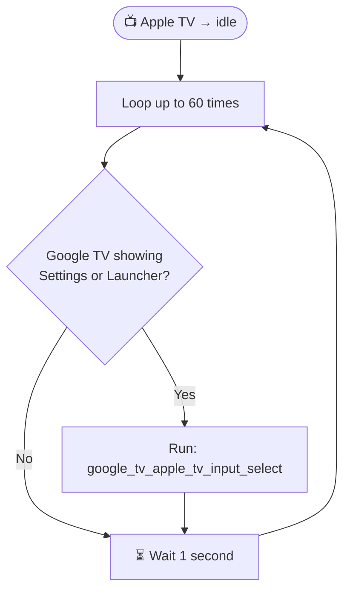
```mermaid
flowchart TD
    T([📺 Apple TV → idle]) --> LOOP[Loop up to 60 times]
    LOOP --> C{Google TV showing\nSettings or Launcher?}
    C -->|Yes| A[Run: google_tv_apple_tv_input_select]
    C -->|No| WAIT[⏳ Wait 1 second]
    A --> WAIT
    WAIT --> LOOP
```

---

## 21. Notification: Minecraft Server
**Entity:** `automation.minecraft_server_notifications`

Sends iPhone notification when player count goes above 0.

```mermaid
flowchart TD
    T([🎮 Minecraft player count > 0]) --> N[📱 Notify: Player joined!\nX player's online]
```

---

## 22. System: Sleep Mode Automations
**Entity:** `automation.disable_automations_for_sleeping`

Disables automations labelled `sleeping_disabled` when both sleep focus is on AND iPhone is charging. Re-enables otherwise.

```mermaid
flowchart TD
    T1([📱 iphone_sleep_focus_mode changes]) --> C
    T2([🔌 iphone_charging changes]) --> C
    C{Sleep focus ON\nAND charging ON?}
    C -->|Yes| A[Turn OFF automations\nwith label: sleeping_disabled]
    C -->|No| B[Turn ON automations\nwith label: sleeping_disabled]
```

---

## 23. Lighting: Entrance Presence
**Entity:** `automation.lights_on_when_someone_enters_apartment`

When entrance motion sensor fires and shoerack light is off and not in sleep mode, turns on all common area lights with adaptive lighting.

```mermaid
flowchart TD
    T([🚶 Entrance motion sensor → ON]) --> C1{Shoerack light OFF?}
    C1 -->|Yes| C2{Sleep mode OFF?}
    C2 -->|Yes| A[Apply adaptive lighting\nto living room, kitchen,\ndesk, shoerack, lamp strips]
    C2 -->|No| SKIP[⛔ Skip]
    C1 -->|No| SKIP
```

---

## 24. System: Nintendo Toy Shutdown
**Entity:** `automation.turn_off_nintendo_toy_during_home_assistant_shutdown`

Runs the Nintendo toy off script when Home Assistant shuts down.

```mermaid
flowchart TD
    T([⛔ Home Assistant shutdown]) --> A[Run: nintendo_toy_off]
```

---

## 25. System: Nintendo Toy Button
**Entity:** `automation.turn_off_nintendo_toy_button_helper`

Runs the Nintendo toy off script when the button helper is pressed.

```mermaid
flowchart TD
    T([🔘 input_button.turn_off_nintendo_toy_helper pressed]) --> A[Run: nintendo_toy_off]
```

---

## 26. Safety: Soldering Iron Alert
**Entity:** `automation.soldering_iron_safety_notification`

5 minutes after soldering iron turns on, sends a critical notification. If no response in 60s, auto-turns it off.

```mermaid
flowchart TD
    T([🔌 Tapo soldering plug → ON]) --> WAIT[⏳ Wait 5 minutes]
    WAIT --> C1{Still ON?}
    C1 -->|Yes| NOTIFY[📱 Critical notify:\nKeep On / Turn Off Now\noptions]
    NOTIFY --> WAIT60[⏳ Wait 60 seconds]
    WAIT60 --> C2{Still ON?}
    C2 -->|Yes| OFF[Turn off soldering iron\n📱 Notify: auto-off]
    C2 -->|No| DONE[✅ Done — user responded]
    C1 -->|No| DONE2[✅ Done — turned off]
```

---

## 27. Safety: Soldering Iron Keep On
**Entity:** `automation.soldering_iron_keep_on_action`

When KEEP_IRON_ON notification action is tapped, re-triggers the safety timer and notifies the timer was reset.

```mermaid
flowchart TD
    T([📱 Notification action: KEEP_IRON_ON]) --> A[Re-trigger safety alert automation\nskipping condition]
    A --> N[📱 Notify: Timer reset — 5 more minutes]
```

---

## 28. Safety: Soldering Iron Turn Off
**Entity:** `automation.soldering_iron_turn_off_now_action`

When TURN_OFF_NOW notification action is tapped, immediately turns off the soldering iron.

```mermaid
flowchart TD
    T([📱 Notification action: TURN_OFF_NOW]) --> A[Turn off soldering iron plug]
    A --> N[📱 Notify: Soldering iron off]
```

---

## 29. Safety: Soldering Pegboard Light
**Entity:** `automation.pegboard_light_for_soldering_iron`

Shows red Plasma effect on pegboard while soldering iron is on. On turn-off, briefly breathes then returns to desk strip color (or turns off if lights are off).

```mermaid
flowchart TD
    T([🔁 Soldering iron plug state changes]) --> C1{Iron ON?}
    C1 -->|Yes| RED[Pegboard → 100% red Plasma]
    C1 -->|No| C2{Shoerack light ON?}
    C2 -->|Yes| BREATHE[Pegboard → Breathe effect]
    BREATHE --> WAIT[⏳ Wait 5 seconds]
    WAIT --> MATCH[Pegboard → Solid, match desk color]
    C2 -->|No| OFF[Turn off pegboard]
```

---

## 30. Presence: Away Mode
**Entity:** `automation.away_mode`

Watches iPhone location. If home: enables automations with label `away_mode_disables`. If away: disables them.

```mermaid
flowchart TD
    T([📍 iPhone latitude changes]) --> C{iPhone state = home?}
    C -->|Yes| ON[Turn ON automations\nwith label: away_mode_disables]
    C -->|No| OFF[Turn OFF automations\nwith label: away_mode_disables]
```

---

## 31. Lighting: Bathroom Night Path
**Entity:** `automation.heading_to_the_bathroom_night_lights`

During sleep mode, when bedroom motion sensor detects occupancy, briefly lights up bed frame strips at full red Candle Multi, then dims back after 5 seconds.

```mermaid
flowchart TD
    T([🚶 Bedroom motion → occupied]) --> C{Sleep mode ON?}
    C -->|Yes| A[Bed frame strips → 100% red Candle Multi]
    A --> WAIT[⏳ Wait 5 seconds]
    WAIT --> DIM[Bed frame strips → 1% red]
    C -->|No| SKIP[⛔ Skip]
```

---

## 32. Lighting: Party Mode
**Entity:** `automation.lighting_random_rgb_colors`

When Random Scene button is pressed, pauses adaptive lighting for the rest of the day and sets random colors on all lights.

```mermaid
flowchart TD
    T([🔘 input_button.random_scene pressed]) --> PAUSE[Turn ON adaptive_lighting_paused]
    PAUSE --> LOOP[For each light in light.lights group]
    LOOP --> COLOR[Set random color\nred/green/blue/orange/\nmagenta/cyan/yellow]
    COLOR --> LOOP
```

---

## 33. System: Git Config Auto Push
**Entity:** `automation.auto_push_git_config`

Every 5 minutes, runs the `shell_command.git_push_config` to commit and push HA config changes to git.

```mermaid
flowchart TD
    T([⏱ Every 5 minutes]) --> A[Run shell: git_push_config]
```

---

## 34. Climate: Save and Turn Off When Leaving
**Entity:** `automation.climate_save_and_turn_off_when_leaving_2`

When iPhone leaves the Home zone, saves AC state to helpers and turns it off. If AC was already off, clears the saved flag.

```mermaid
flowchart TD
    T([📍 iPhone leaves Home zone]) --> C{AC is ON?}
    C -->|Yes| SAVE[Save: ac_was_on_when_left = ON\nSave temperature\nSave HVAC mode]
    SAVE --> OFF[Set AC → off]
    C -->|No| CLEAR[Set ac_was_on_when_left = OFF]
```

---

## 35. Lighting: Reset Adaptive Lighting Pause at Midnight
**Entity:** `automation.lighting_reset_adaptive_lighting_pause_at_midnight`

Clears the adaptive lighting pause flag every night at midnight so it's fresh for the next day.

```mermaid
flowchart TD
    T([⏰ Every day at 00:00]) --> A[Turn OFF adaptive_lighting_paused]
```

---

## 36. Climate: Auto Eating Mode On
**Entity:** `automation.climate_auto_eating_mode_on`

When Apple TV starts playing video AND kitchen motion sensor shows recent activity (>3 triggers in last 15 min) AND eating mode is off, automatically activates eating mode with a cancellable notification.

```mermaid
flowchart TD
    T([▶️ Apple TV → playing]) --> C1{Eating mode OFF?\nMedia is video?\nKitchen motion > 3?}
    C1 -->|All yes| ON[Turn ON eating_mode]
    ON --> N[📱 Notify: Eating Mode On\nwith Turn Off action]
    C1 -->|Any no| SKIP[⛔ Skip]
```

---

## 37. Climate: Auto Eating Mode Off
**Entity:** `automation.climate_auto_eating_mode_off`

Turns off eating mode 5 minutes after Apple TV stops playing, or at midnight as a failsafe.

```mermaid
flowchart TD
    T1([⏸ Apple TV stops playing for 5 min]) --> C
    T2([⏰ Midnight]) --> C
    C{Eating mode ON?}
    C -->|Yes| A[Turn OFF eating_mode]
    C -->|No| SKIP[⛔ Skip]
```

---

## 38. Notification: Cancel Eating Mode
**Entity:** `automation.notification_cancel_eating_mode`

Handles the CANCEL_EATING_MODE notification action tap — turns off eating mode and confirms.

```mermaid
flowchart TD
    T([📱 Notification action: CANCEL_EATING_MODE]) --> A[Turn OFF eating_mode]
    A --> N[📱 Notify: Eating mode cancelled]
```

---

## 39. Lighting: Adaptive Sun Schedule
**Entity:** `automation.lights_adaptive_lighting_schedule`

Every 30 minutes, applies sun-elevation-based color temperature to all on lights. Skips during sleep mode, when Apple TV is playing anything, or when adaptive lighting is paused.

```mermaid
flowchart TD
    T([⏱ Every 30 minutes]) --> C1{Any lights ON?}
    C1 -->|Yes| C2{Sleep mode OFF?}
    C2 -->|Yes| C3{AL paused OFF?}
    C3 -->|Yes| C4{Apple TV NOT playing?}
    C4 -->|Yes| A[Apply adaptive lighting\nto all ON lights]
    C4 -->|No| SKIP[⛔ Skip — music/media playing]
    C3 -->|No| SKIP2[⛔ Skip — AL paused]
    C2 -->|No| SKIP3[⛔ Skip — sleep mode]
    C1 -->|No| SKIP4[⛔ Skip — no lights on]
```

---

## 40. Lighting: Cubby Sleep Color
**Entity:** `automation.lighting_cubby_sleep_color`

Sets the cubby light red during sleep mode and green when awake. Triggers on sleep focus changes, cubby turning on, and HA startup.

```mermaid
flowchart TD
    T1([📱 iphone_sleep_focus_mode changes]) --> C
    T2([💡 light.cubby turns ON]) --> C
    T3([🏠 HA starts]) --> C
    C{Cubby light ON?}
    C -->|Yes| C2{Sleep mode ON?}
    C2 -->|Yes| RED[Cubby → 1% red Candle Multi]
    C2 -->|No| GREEN[Cubby → 10% green Solid]
    C -->|No| SKIP[⛔ Skip]
```

---

## 41. Eating: Dim Back Lights
**Entity:** `automation.eating_dim_back_lights`

When eating mode turns OFF during video playback, turns off the back/desk lights over 5s.

```mermaid
flowchart TD
    T([🍽 eating_mode → OFF]) --> C{Apple TV playing video?}
    C -->|Yes| A[Turn off vertical strip,\npegboard, desk strips & lamp\nover 5s transition]
    C -->|No| SKIP[⛔ Skip]
```

---

## 42. Eating: Restore Back Lights
**Entity:** `automation.eating_restore_back_lights`

When eating mode turns ON during video playback, restores back/desk lights to adaptive lighting.

```mermaid
flowchart TD
    T([🍽 eating_mode → ON]) --> C{Apple TV playing video?}
    C -->|Yes| A[Apply adaptive lighting\nto vertical strip, pegboard,\ndesk strips & lamp]
    C -->|No| SKIP[⛔ Skip]
```

---

## 43. Media: Theater Mode Off
**Entity:** `automation.media_theater_mode_off`

When Apple TV stops playing (paused/idle/standby), restores living room to adaptive lighting and turns cubby back on.

```mermaid
flowchart TD
    T1([⏸ Apple TV → paused]) --> C
    T2([💤 Apple TV → idle]) --> C
    T3([📴 Apple TV → standby]) --> C
    C{Sleep mode OFF?}
    C -->|Yes| A[Apply adaptive lighting\nto living room]
    A --> B[Turn on cubby light]
    C -->|No| SKIP[⛔ Skip]
```

---

## 44. Cleaning: Vacuum After Cooking
**Entity:** `automation.cleaning_vacuum_after_cooking`

After extended kitchen activity (>24 triggers in 15 min), schedules a kitchen vacuum. Waits for kitchen to be empty for 20 min, then vacuums (+ mops if 3+ days since last mop). Cancellable via notification.

```mermaid
flowchart TD
    T([🍳 Kitchen motion sensor > 24 triggers in 15 min]) --> N[📱 Notify: Cleanup in 20 min\nwith Cancel action]
    N --> FLAG[Set vacuum_will_auto_clean_kitchen = ON]
    FLAG --> WAIT[Wait for kitchen empty 20 min\nor 2hr timeout]
    WAIT --> C1{Flag still ON?}
    C1 -->|Yes| C2{Last mop ≥ 3 days ago?}
    C2 -->|Yes| MOP[Set mop mode\nVacuum + mop segment 6\nUpdate last mop timestamp]
    C2 -->|No| VAC[Vacuum-only\nsegment 6]
    MOP --> CLEAR[Clear flag\nWait 15 min]
    VAC --> CLEAR
    C1 -->|No| CANCELLED[✅ User cancelled]
```

---

## 45. Cleaning: Weekly Full Clean
**Entity:** `automation.cleaning_weekly_full_clean`

Every Tuesday at noon, sends notification and runs a full vacuum + mop of all 7 room segments.

```mermaid
flowchart TD
    T([⏰ Every Tuesday at 12:00]) --> N[📱 Notify: Weekly Full Clean Starting]
    N --> MOP[Set mop mode on vacuum]
    MOP --> WAIT[⏳ Wait 2 seconds]
    WAIT --> A[Vacuum + mop all segments 1–7\nsuction level 3]
    A --> B[Update last_mop_use timestamp]
```